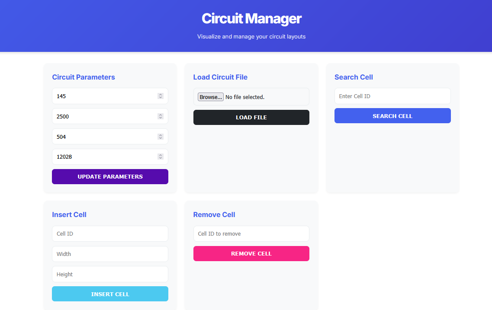

# EDA - Circuit Manager

## Overview

Circuit Manager is a web application designed to visualize and manage circuit layouts. It provides an interactive interface for loading, searching, inserting, and removing cells in a circuit configuration, with real-time visualization of the circuit structure.



---

## Features

- **Interactive circuit visualization**
- **Load circuit data from files**
- **Search for specific cells by ID**
- **Insert new cells with specified dimensions**
- **Remove existing cells**
- **Adjust circuit parameters (rows, dimensions, capacity)**
- **Download modified circuit data**

---

## Technologies Used

- **Backend:** Python with Flask framework
- **Frontend:** HTML5, CSS3, JavaScript
- **Data Structure:** Custom Hash Table implementation
- **Visualization:** HTML5 Canvas
- **Styling:** Custom CSS with responsive design

---

## Data Structure

The application uses a custom Hash Table implementation (`HashTable` class) for efficient cell storage and retrieval. The circuit is organized as:

- A list of rows (each row is a list of cells)
- A hash table mapping cell IDs to cell objects

### Cell Structure

Each cell contains:

- **ID** (string)
- **Width** (float)
- **Height** (float)
- **X position** (float)
- **Row index** (integer)

---

## Operations and Complexities

- **Insert Cell:**
  - Average: O(n) where n is the number of cells in the target row
  - Worst case: O(n) when searching for insertion position

- **Search Cell:**
  - Average: O(1) due to hash table lookup
  - Worst case: O(n) in case of hash collisions (unlikely with good hash function)

- **Remove Cell:**
  - Average: O(1) for hash table removal + O(n) for list removal in row
  - Worst case: O(n) when cell is last in row

- **Load File:**
  - O(m) where m is the number of lines in the file, multiplied by insert complexity

---

## API Endpoints

| Method | Endpoint           | Description                        |
|--------|--------------------|------------------------------------|
| GET    | `/`                | Main interface                     |
| POST   | `/update_params`   | Update circuit parameters          |
| POST   | `/load`            | Load circuit data from file        |
| POST   | `/search`          | Search for a cell by ID            |
| POST   | `/insert`          | Insert a new cell                  |
| POST   | `/remove`          | Remove a cell by ID                |
| GET    | `/download`        | Download modified circuit data     |
| GET    | `/circuit_json`    | Get JSON representation of circuit |

---

## Interface Description


The web interface consists of:

- **Parameter Configuration:** Set rows, dimensions, and capacity
- **File Operations:** Load circuit data from file
- **Cell Operations:** Search, insert, and remove cells
- **Visualization Canvas:** Interactive display of circuit layout
- **Download Button:** Export modified circuit data

**Features:**

- Responsive design for different screen sizes
- Interactive tooltips on cell hover
- Flash messages for operation feedback
- Auto-scroll to searched cells

---

## Installation and Usage

1. **Install Python dependencies:**
    ```bash
    pip install flask
    ```

2. **Run the application:**
    ```bash
    python app.py
    ```

3. **Access the application:**
    - Open your browser and go to [http://localhost:5000](http://localhost:5000)

---

## File Format

Circuit files should be text files with each line representing a cell in the format:

```
<cell_id> <width> <height>
```

**Example:**
```
a1 10.5 5.2
a2 8.3 5.2
```

---

## Future Improvements

- Support for more cell ID formats
- Enhanced visualization with zoom/pan
- Undo/redo functionality
- Additional circuit metrics and analysis
- User authentication for multi-user scenarios

---

## License

This project is open-source and available for use under the MIT License.

---

## Author

Lincon Avila de Souza - 2025